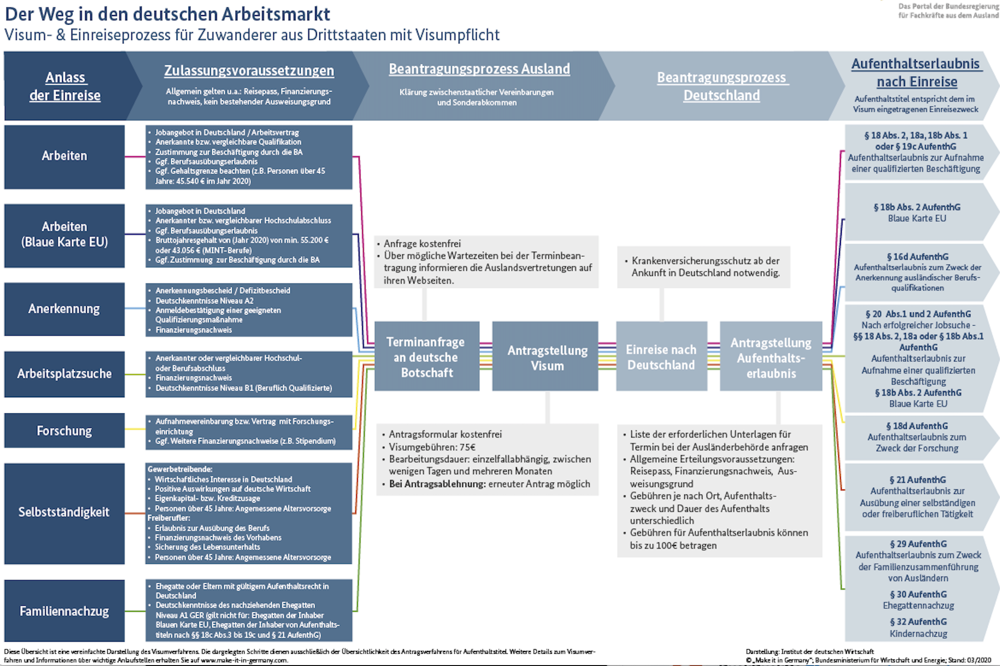

```{r include=FALSE}
library(dplyr)
library(ggridges)
library(ggplot2)
library(patchwork)
library(rpart)
library(rpart.plot)

rm(list = ls())
```


## The problem we have to solve ...




## ...using statistics

Train a statistical model that estimates the probability of a visa assignment, depending on the characteristics of a user. 

1. Country of origin
2. Annuale income
3. Job type (understaffed profession Yes / No)
4. Valid degree (Anabin Database)

```{r}
# 1. Create DF with all possible combinations
country_type <- c("Third-country", "EU", "Privileged")
income <- seq(30000,55000,500)
mangelberuf <- c("Yes","No")
valid_degree <- c("Yes","No")

col_names <- c("country_type", "income", "mangelberuf", "valid_degree")

df <- expand.grid(country_type, income, mangelberuf, valid_degree)
colnames(df) <- col_names
```

```{r}
# 2. Assign the visa based on the rules
df <- mutate(df,
       visa_type = case_when(
         # Blue card I
         country_type == "Third-country" & valid_degree == "Yes" & income >= 52000 ~ "Blue card",
          # Blue card II
         country_type == "Third-country" & valid_degree == "Yes" & 
          mangelberuf == "Yes" & income > 43056 ~ "Blue card",
         # Normal residence permit 
         country_type == "Third-country" & valid_degree == "Yes" & 
          income %in% seq(45530,51999) ~ "Residence permit for employment",
         # No RP required
         country_type != "Third-country" ~ "No residence permit required",
         TRUE ~ "Plan B")
)
```

```{r}
# Duplicate the df so we can split into training/test 
newempl2_df <- rbind(df, df)

# Generate a random list of index from 1 to 1309 (i.e. the maximum number of rows)
shuffle_index <- sample(1:nrow(newempl2_df))
#  use this index to shuffle the titanic dataset.
newempl2_df <- newempl2_df[shuffle_index, ]

# Convert NA to 0
newempl2_df[is.na(newempl2_df)] <- 0

## Create train / test set

create_train_test <- function(data, size = 0.8, train=TRUE) {
  n_row = nrow(data)
  total_row = size * n_row
  train_sample <- 1:total_row
  if (train == TRUE) {
    return (data[train_sample, ])
  } else {
    return (data[-train_sample, ])
  }
}
```

```{r fig.height=10, fig.width=10}
# x-vars
xvars <- colnames(newempl2_df %>% select(country_type:valid_degree))
# y-var
yvar <- "visa_type"

# take one bucket as yvar
model_df <- newempl2_df %>% select(xvars, yvar)

data_train <- create_train_test(model_df, 0.8, train = TRUE)
data_test <- create_train_test(model_df, 0.8, train = FALSE)

fit <- rpart(visa_type~., data = data_train, method = 'class')
rpart.plot(fit)
```

### Predict the visa types for our Users

```{r eval=FALSE, include=FALSE}
# Load userdata
load("../../../Analytics/script/cleaned_data.RData")

predict_df <- international_df_clean %>%
  select(name, country, country_type) %>%
  mutate(
    valid_degree = sample(c("Yes","No"),n(), replace = TRUE),
    mangelberuf = sample(c("Yes","No"),n(), replace = TRUE),
    income = sample(seq(41000,55000,500),n(), replace = TRUE),
    country_type = ifelse(country_type == "GB" | is.na(country_type), "Third-country",country_type)
  )

saveRDS(predict_df, "../input/test_data.Rds")
```

```{r}
predict_df <- readRDS("../input/test_data.Rds")

predict_df %>%
  sample_n(20) %>%
  htmlTable::htmlTable(align = "l")
```

```{r eval=FALSE, fig.height=8, fig.width=10, include=FALSE}
p1 <- predict_df %>%
  ggplot(aes(country_type)) +
  geom_bar(fill="#2b8cbe") +
  labs(x = NULL, y = NULL) +
  coord_flip() +
  hrbrthemes::theme_ipsum() 

p2 <- predict_df %>%
  ggplot(aes(mangelberuf)) +
  geom_bar(fill="#69b3a2") +
  labs(y = NULL, x = "Understaffed profession?") +
  coord_flip() +
  hrbrthemes::theme_ipsum() 

p3 <- predict_df %>%
  ggplot(aes(valid_degree)) +
  geom_bar(fill="#2b8cbe") +
  labs(y = NULL, x = "Valid degree?") +
  coord_flip() +
  hrbrthemes::theme_ipsum() 

p4 <- predict_df %>%
  ggplot( aes(income)) +
  hrbrthemes::theme_ipsum() +
  geom_density(fill="#69b3a2", color="#e9ecef", alpha=0.8)

(p1 | p4 ) /
      (p2 | p3)
```


```{r}
predict_unseen <-predict(fit, predict_df, type = 'class')

predict_df$visa_type <- predict_unseen

predict_df %>% sample_n(20) %>% htmlTable::htmlTable(align="l")
```

```{r}
predict_df %>%
  ggplot(aes(visa_type)) +
  geom_bar(fill="#2b8cbe") +
  labs(y = NULL, x = NULL) +
  coord_flip() +
  hrbrthemes::theme_ipsum() 
```


